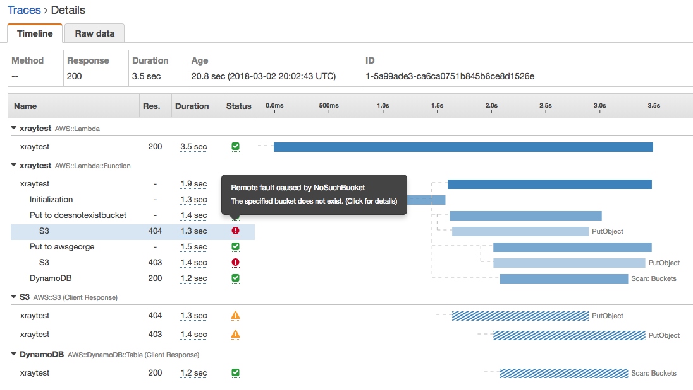

# xrayExamplesLambda

## Introduction
AWS  [X-Ray](https://aws.amazon.com/xray/) is a service that helps developers debug, instrument, and performance tune applications.
This example demostrates how to use X-Ray to instrument a "mock" application. The application:

1. Performs a S3 PutObject to a bucket that does not exist
2. Performs a S3 PutObject to a bucket that exists, but we have no permissions to
3. Performs a Scan against a DynamoDB Table

There is no error catching or logging place and the code simply returns a success code at the end:

```node
callback(null, {"body" : "testbody"} )
```

At first glance,  running this application will look like it succeeded because of lack of log and error catching.
Enabling XRay will show a very different result. You can instruct X-Ray to instrument all calls made by the AWS SDK with a wrapper like this:

```node
var AWSXRay = require('aws-xray-sdk-core');
var AWS  = AWSXRay.captureAWS(require('aws-sdk'));
```

Upon inspecting the X-Ray trace results, we see something like this:


It becomes obvious that the S3 PutObjects encountered failures. We can also see the timing of each API call.

## Setup

You must install the X-Ray Node SDK in your working directory. First create your package.json file by running:

```
npm init
```
Then install the X-Ray Node SDK

```
npm install aws-xray-sdk --save
```

Once you have written your code, zip the *contents* of the working folder (not the to level folder itself) and upload to Lambda to test!

## Resources

- **xraytest** - A NodeJS example that has X-Ray active API Tracing wrapped around all AWS-SDK Calls.